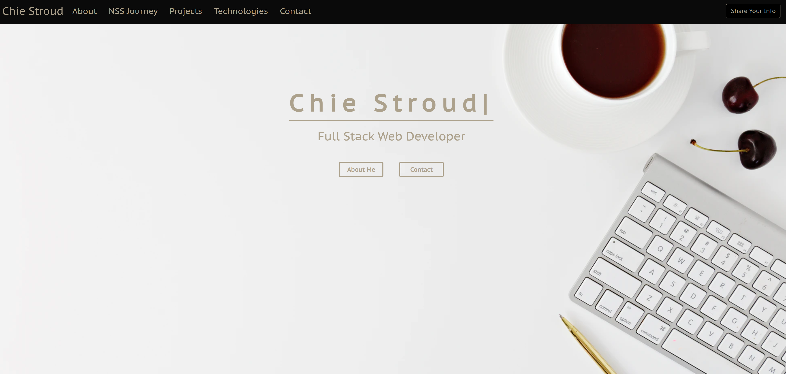

# Bookmarkable - JavaScript Version

## Overview
This is a social & personal bookmarking application to help people organize learning resources. Users of this app can post useful resources in an Open Space and other users can review all the recommended read/tutorials/other resources with user comments. If they wish to keep the post private for their own personal use, they can save the link and comments to their own personal page. Persoal page is all yours so you can add any categories and bookmarks as you would like.

## Images from Bookmarkable
(Top left - without signing in / Top right - Open Space / Bottom left - Personal)

  
  
  

## Mobile images from Bookmarkable

  
  

## Loom Video
https://www.loom.com/share/fef243fa19774c359aecd04b3d3b6532
## Wireframes
[Link to Wireframe](https://www.canva.com/design/DAEeSWGLbBs/share/preview?token=xad8ziga5nxnVMmXKoaIkQ&role=EDITOR&utm_content=DAEeSWGLbBs&utm_campaign=designshare&utm_medium=link&utm_source=sharebutton)

## Link to Project Board
https://github.com/chiestroud/Bookmarkable/projects

## ERD
[Link to ERD](https://dbdiagram.io/d/607a3d63ef1b8f6b3dd5aefd)

## Flowchart
[Link to Flowchart](https://docs.google.com/presentation/d/1riWBSH_KAwCb5nFBl29pyfBjhj1CzDOvJe4PO-HkNdA/edit?usp=sharing)

## Technologies used to build this portfolio
HTML / SCSS / JavaScript / React / Firebase

## How to run
<ol>
  <li>Clone down this repo</li>
  <li>npm install</li>
  <li>Create new firebase project and copy all the keys inside .env file</li>
  <li>npm start</li>
<ol>

## Personal Biosite
[Chie Stroud's Portfolio Site](https://chiestroud.com/)

  

